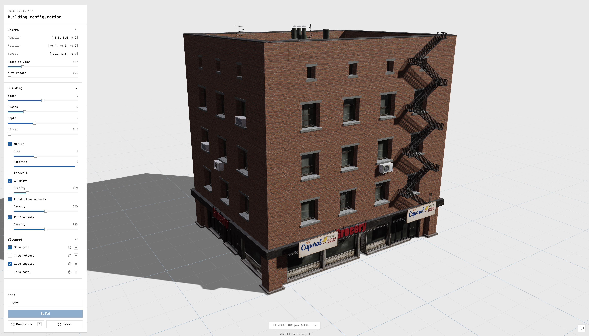

# Building Configurator V2

Version 2.0.0

## About

An interactive 3D building configurator. Create and customize procedural buildings, adjust their structure and details, and inspect individual elements in the scene. Generation runs in a Web Worker to keep the interface responsive.

## Preview

## Stack

- React 19 and TypeScript
- Three.js, React Three Fiber, and Drei
- Zustand
- Tailwind CSS 4, shadcn-styled components, and Base UI
- Vite
